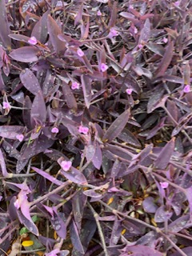

# Week 5
## Acorns #nature 

Some species of tree spread large numbers of acorns for the purpose of creating more trees, but only a small handful actually become new saplings. The rest become food for small animals like squirrels or chipmunks, or decompose into natural fertilizer for other species of plants.

## Large Bush #nature 

This tree has evolved very dense foliage, which allows the collection of much more sunlight than the average tree. This dense foliage comes with the drawback of being much heavier, requiring a stronger trunk and branches; it also makes it more difficult for other plant species to grow beneath it.

## Plant with Purple Leaves #nature 

It is fairly uncommon for a plant to have purple leaves, the above being one example. Since purple light contains more energy than green light, having purple leaves effectively reduces the amount of energy that the plant collects from the sun. This adaptation is useful in bright environments, where excessive sunlight would normally threaten to damage the plant rather than feed it.

## Improved Car Sensors #human
Current sensors in cars for distance from objects, speed, etc, have already improved function and safety be leaps and bounds. They do have their drawbacks still--mainly, it can be difficult to detect depth, size, or similar using only a camera or distance sensor.

## Meal Planning #human
Whether food is being prepared for one person or for a large group, it can be difficult to effectively use raw ingredients  and prepared dishes without leaving some wasted. Maybe nature could provide a solution allowing only necessary food to be prepared, or allowing unused ingredients and uneaten meals to be reused.

## Noise Sensitive Applications #human 
When there is a need for silence, such as during a ceremony or a lecture, or perhaps late at night when others are sleeping, it becomes apparent just how loud many common actions are. Actions such as opening a velcro pocket, pulling on a zipper, or taking a phone call become next to impossible without drawing attention and being disruptive. Perhaps some way exists to muffle noises such as these, without excessively impacting their normal function.

# Week 6
## Deer #nature

Deer like the one above have large antlers, used for a variety of purposes. The material they are made from starts out soft, but gradually grows and hardens over the course of several months. Due to the way antlers grow, each set is almost guaranteed to be unique

## Bright yellow and red flowers #nature 

The bright flowers on this plant are useful to attract pollinators. The multiple colors appear in rings, with the red outer ring surrounding the yellow inner ring.

## The Moon #nature 

While not a living organism like a plant or an animal, the moon is still an important part of Earth's ecosystem. Many aquatic species depend on the tides it causes for their migration, mating, or distribution of food and materials. Nocturnal organisms use its light for navigation, and even humans relied on its phase and position in the sky for timekeeping, navigation, and tracking patterns of sea life for food.

## Computer Use and Back Problems #human
Continued use of computers, phones, and the like has been seen to contribute to back problems and other forms of repetitive stress injuries. This is due in part to poor posture, encouraged by the need to sit for long periods of time and look at the screen at the right angle.

## Animal-Friendly Buildings #human
Current infrastructure does its best to keep humanity an nature separate, and encourage wildlife to seek out different habitats to live. Instead of devoting large amounts of resources to pest deterrent, it may be possible to instead provide ways for wildlife to coexist in the same areas, and even provide beneficial services to humanity.

## Adaptable and Sanitary Storage #human 
When there is only a small area available to store items, they quickly begin to pile up, and objects underneath become impossible to access. At the same time, objects with special storage requirements simply cannot be stored there, for example fragile items which can only support so much weight, or dirty items needing to be kept separate from clean ones. Maybe nature has a solution that allows items to be stored in a smaller space, while accommodating for ease of access, cleanliness, and fragility of the items.

# Week 7
## Dandelion #nature 

Dandelions spread their seeds using the wind, and can thrive almost anywhere, leading to their widespread propagation. 

## Cherry Blossom #nature 

These trees use their bright blossoms to attract pollinators. Their appearance also lends to their propagation as they are attractive to humans.

## Trees on a Mountain #nature 

Trees such as the species shown above tend to grow much more sparsely on one side of the valley than the other. This could be the result of high winds that affect one side of the valley more than the other, or by the direction of the sun, which could spend more of the day shining on the left than on the right. Either way, most these trees have adapted to seek out the better conditions, while the sparse vegetation on the opposite side benefits from increased sunlight and more area to grow.

## Airborne Dust #human 
Whenever objects are left in place for a long time indoors, they tend to develop a thin layer of dust. Even leaving something out for just a few moments can lead to a few particles collecting here and there, which can be a problem in sensitive applications such as applying screen protectors or stickers, or working with home electronics. While applications already exist to filter dust out of the air or to create clean rooms free of dust altogether, neither of these options are particularly affordable or feasible in many situations. Perhaps there may be a way to clear the dust from an area for a short amount of time, so that a task requiring clean air may be performed safely and cheaply.

## Camera Exposure #human 
When a traditional digital camera is used to take a picture involving a bright light source, the photographer usually has to decide between either having the light be overwhelmingly bright, or the rest of the scene be washed out and dark. Maybe there exists some adaptation in nature that would allow the camera to process light more effectively, such that both problems could be eliminated at once.

## 360 Degree Mirror #human
Normal mirrors usually can't be used to see the back of your own head. Instead, doing so requires a setup of at least two mirrors, but even with this setup it can still be difficult or awkward. Perhaps a shape exists in nature that would allow a fully rotated image to be seen more easily. 

# Week 8
## Red Berries on Bush #nature

The berries from this bush are bright so as to attract wildlife to eat them, allowing it to spread its seeds. In addition, new growths of branches on this plant appear dark blue and purple at first before fading to brown as bark grows in.

## Beetle #nature 

This beetle has long legs which allow it to move relatively quickly for its size. Its patterning could also serve a variety of purposes, though none were exhibited in this photo.

## Mountain Grasshopper #nature 

This grasshopper lives on the side of a mountain, and has a coloration adapted to the fallen leaves and orange-colored rocks of its native terrain. This adaptation protects the grasshopper from predators.

## Alternative to X-ray #human 
Normal medical procedure for determining the presence of abnormalities such as muscle damage or bone fractures is to use an x-ray machine. While the use of x-ray on the body is generally safe, prolonged or repeated exposure to this form of radiation can have serious consequences. This means that it becomes impractical for people at higher risk for these sorts of injuries to be screened for them regularly. If there existed a version of the x-ray procedure that was safer for long term use, it could greatly benefit the health of at-risk patients, and even benefit the doctors performing the test.

## Wrinkle-proof paper #human 
Often, it is important that documents remain uncreased, so that they remain legible and professional. It would be very convenient to have a type of paper that could be folded to fit in a smaller space or quickly stowed in a bag without becoming creased and illegible.

## Alternative Communication Methods #human
Most consumer electronic devices communicate with each other and with the wider world using the same type of wireless signal -- EM radiation in the 2.4G or 5G range. Under normal operation there is no problem with this approach, but in areas such as large cities or crowded buildings, interference between devices quickly becomes a problem. If there were a way to limit the signal strength or switch to another form of communication when longer range signals are not needed, the function of all nearby devices would be drastically improved.

