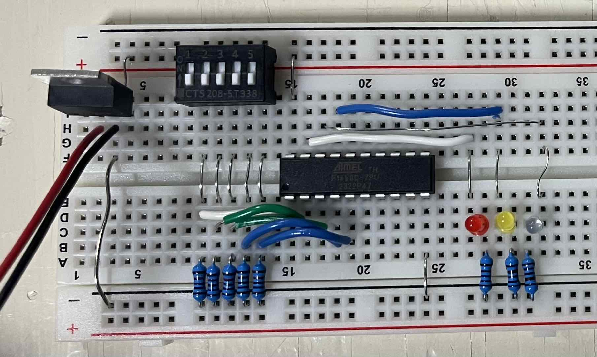
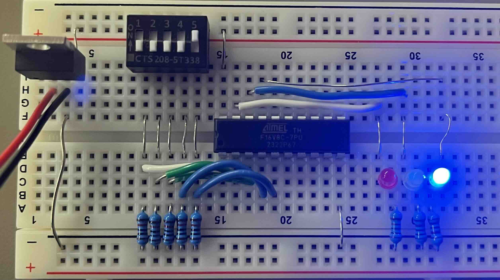
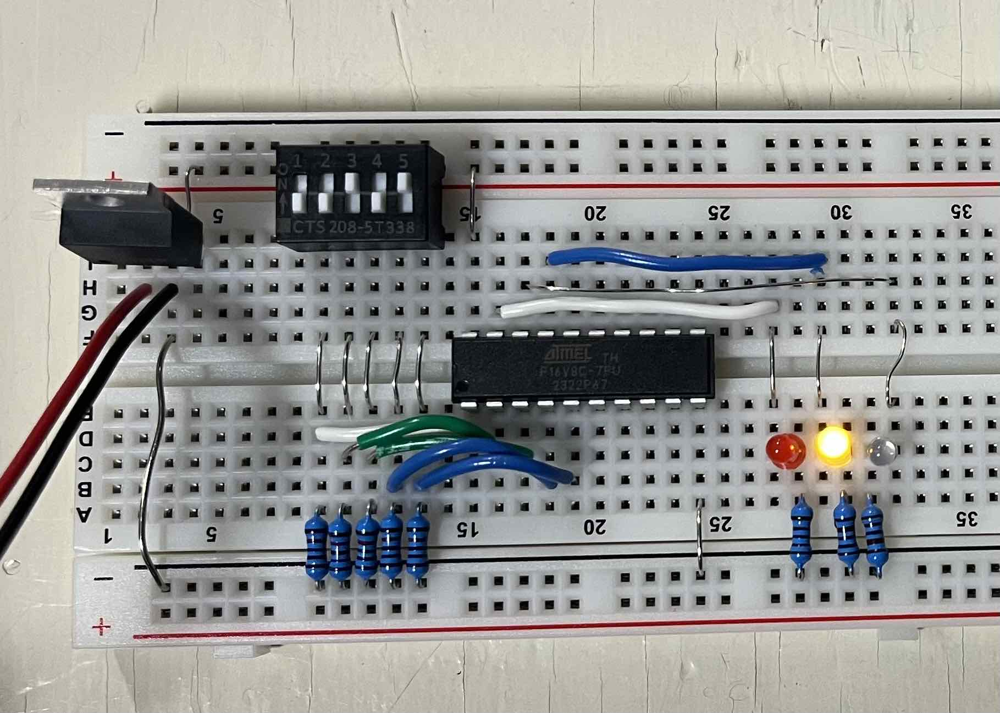
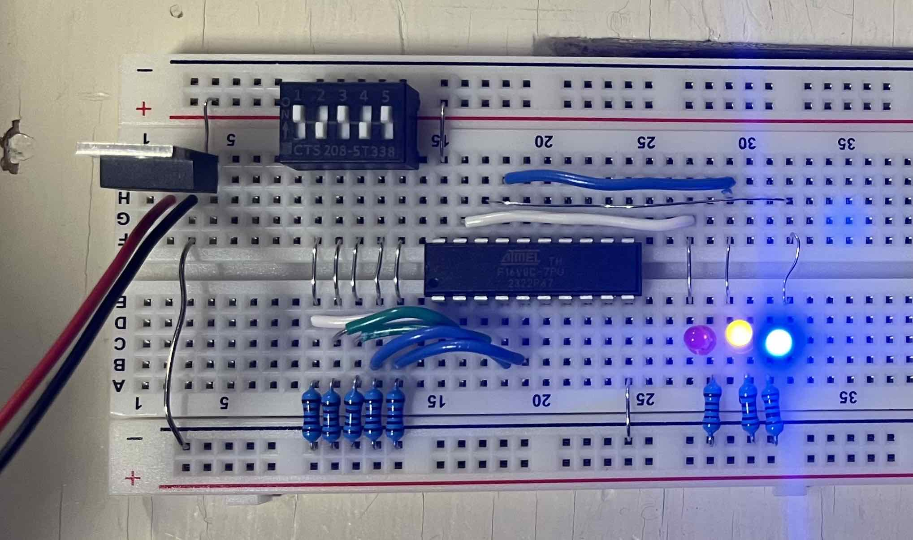
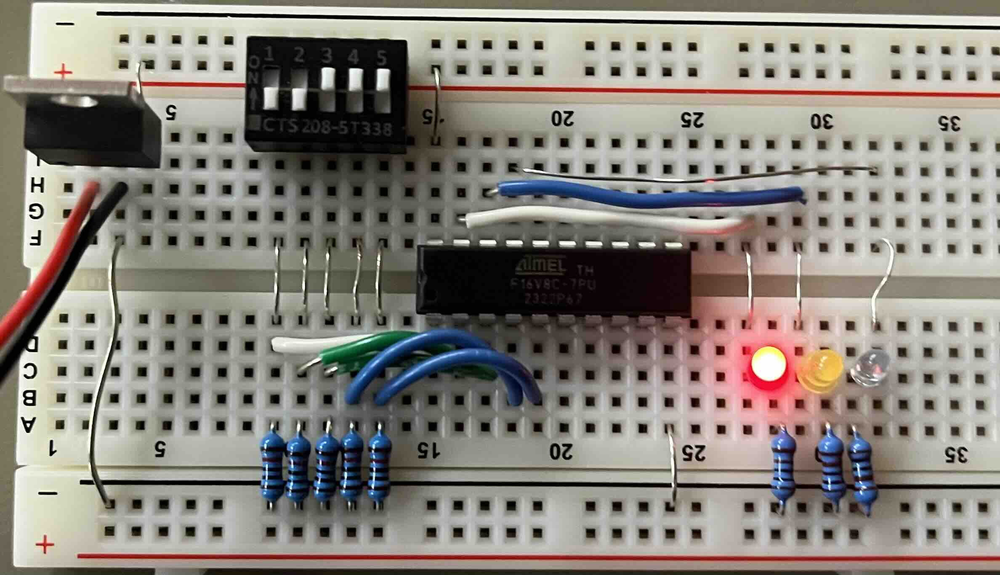
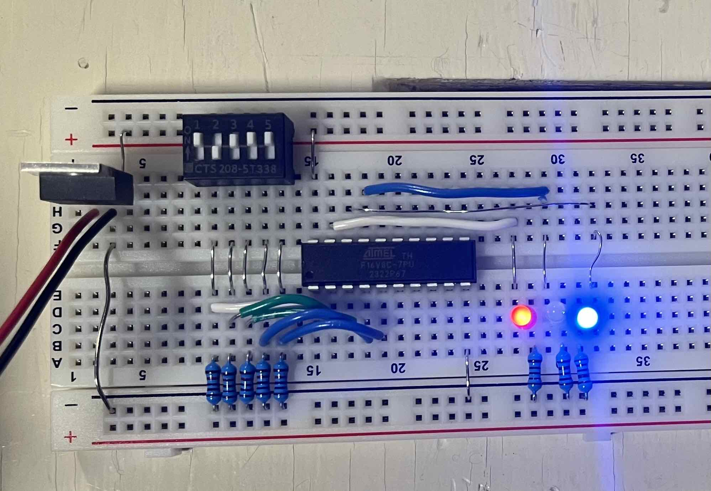
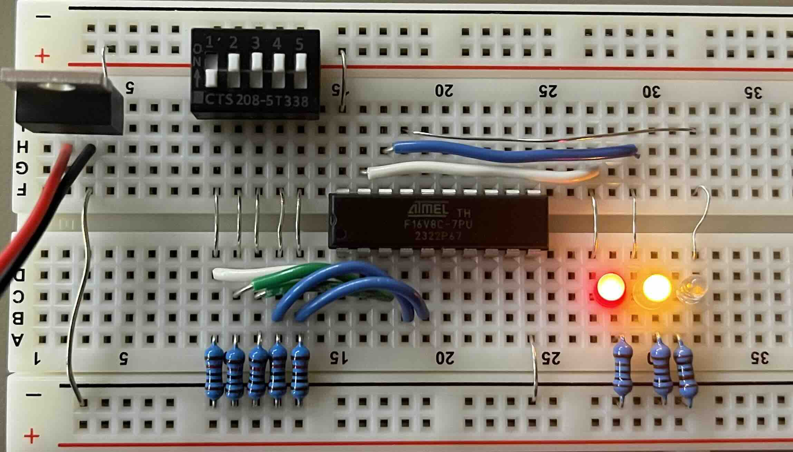
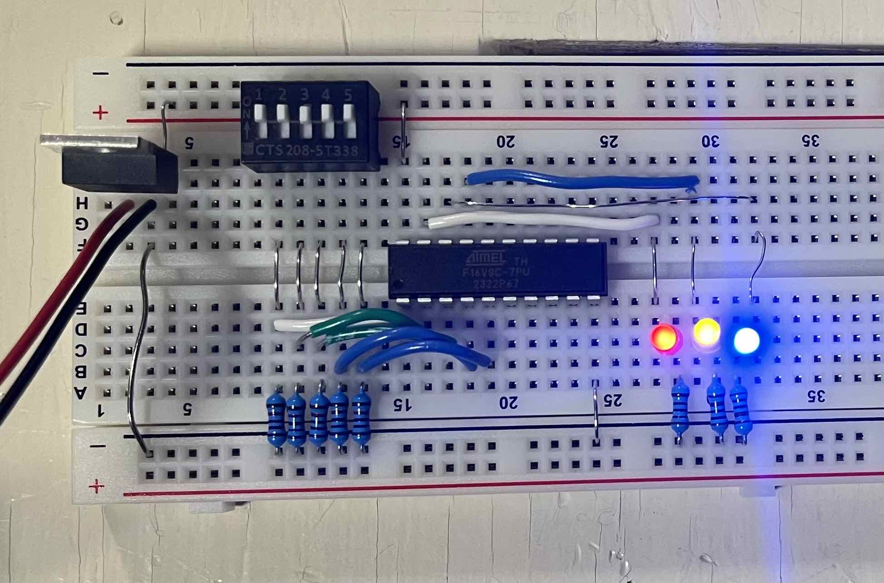

> Design and construct a 2-bit adder with carry input, using the ATF16v8C PLD to accomplish the output functions.

1. Approach to the problem
My approach to solving this problem was extrapolated from the demonstrations given in class. By placing two full adder circuits in series, (each combining two bits and a carry,) a 2-bit adder can be constructed without needing a large and complex karnaugh map. Once the PLD is fused with this program, the provided 5-bit switch can be used as input and a set of 3 LEDs can be used as output.

2. Truth Table, Karnaugh Maps, & Boolean Equations

For each full adder:

$$
\begin{array}{c|c}
\text{In} & \text{Out} \\\\ \hline
000 & 00 \\\\
001 & 01 \\\\
010 & 01 \\\\
011 & 10 \\\\
\end{array} \quad
\begin{array}{c|c}
\text{In} & \text{Out} \\\\ \hline
100 & 01 \\\\
101 & 10 \\\\
110 & 10 \\\\
111 & 11 \\\\
\end{array}
$$

$$
\begin{array}{|cc|cccc|}
 \hline &&&\rlap{X0X1}\\\\
 &S& 00 & 01 & 11 & 10 \\\\ \hline
 C&0 & 0 & 1 & 0 & 1\\\\
 &1 & 1 & 0 & 1 & 0 \\\\\hline
\end{array} \quad
\begin{array}{|cc|cccc|}
 \hline &&&\rlap{X0X1}\\\\
 &C1& 00 & 01 & 11 & 10 \\\\ \hline
 C&0 & 0 & 0 & 1 & 0\\\\
 &1 & 0 & 1 & 1 & 1 \\\\\hline
\end{array}
$$

$$\begin{align}
S &= C\oplus X0\oplus X1 \\\\
C1 &= C(X0 + X1) + X0X1
\end{align}$$

3. Pin assignments

$$
\begin{array}{r}
\llap{C0 - }1\\\\\llap{A0 - }2\\\\\llap{A1 - }3\\\\\llap{B0 - }4\\\\\llap{B1 - }5\\\\6\\\\7\\\\8\\\\9\\\\\llap{Ground - }10
\end{array}\\;
\begin{array}{|c|}
\hline 
\\\\ \\\\ \\\\ \\\\
\text{2-Bit} \\\\ \text{  Adder  } 
\\\\ \\\\ \\\\ \\\\
\\\\\hline
\end{array}\\;
\begin{array}{c}
20\rlap{ - +5V}\\\\19\rlap{ - S0}\\\\18\rlap{ - S1}\\\\17\rlap{ - S2}\\\\16\rlap{ - C1}\\\\15\\\\14\\\\13\\\\12\\\\11
\end{array}
$$

4. WinCupl Code
```c
Name 2BitAdder ;
Date 22/02/2024 ;
Designer Daniel A;
Company TTU;
Device g16v8cp ;

/*---------------INPUT----------------*/
PIN  1 = c0 ; /* carry input          */
PIN  2 = a0 ; /* first number (MSD)   */
PIN  3 = a1 ; /* "                    */
PIN  4 = b0 ; /* second number (MSD)  */
PIN  5 = b1 ; /* "                    */

/*---------------OUTPUT---------------*/
PIN  19 = s0 ; /* output (MSD)        */
PIN  18 = s1 ; /* "                   */
PIN  17 = s2 ; /* "                   */
PIN  16 = c1 ; /* carry from first adder (internal) */

/*---------BOOLEAN FUNCTIONS----------*/
	/* First adder */
	s2 = c0 $ a1 $ b1 ;
	c1 = c0 & (a1 # b1) # a1 & b1 ;

	/* Second adder */
	s1 = c1 $ a0 $ b0 ;	
	s0 = c1 & (a0 $ b0) # a0 & b0 ;
	
```
5. Circuit in Operation

<div>








</div>
